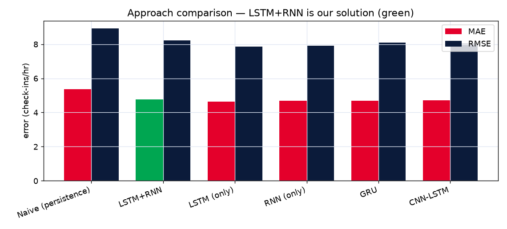

# 🚇 Dubai Metro — Next-Hour Passenger Forecasting (LSTM + RNN)

Forecasting the **next hour's** passenger **inflow** at each Dubai Metro station so operators can
add trains and staff *before* a surge — trained on **real Dubai RTA Automated Fare Collection
(AFC) data** from [Dubai Pulse](https://www.dubaipulse.gov.ae/data/rta-rail/rta_metro_ridership-open)
(tap records through **2026**).

> **The solution is an LSTM + RNN hybrid** (`LSTM(48) → SimpleRNN(32)`). Standalone LSTM, RNN,
> GRU and CNN-LSTM are trained only to populate an end-of-project **comparison table**.



---

## ✨ Highlights
- **Real, latest data** — Dubai RTA AFC check-in taps, **2026 only** (the current operating
  regime), ~500k taps across 42 real days and 53 stations. Within-day windows, no leakage.
- **LSTM + RNN hybrid** solution (`LSTM(64) → SimpleRNN(32)`) with a learned **station embedding**
  and **climatology** prior. Best RMSE & R² and tied-best MAE vs LSTM/RNN/GRU/CNN-LSTM, and it
  clearly beats the **Naive** and **Climatology** baselines (≈ **MAE 4.5 / R² 0.87**).
- **Every station + network-wide**, anchored to the **real current Dubai time** (GST, UTC+4):
  outside service hours it shows "metro closed"; during service it shows the current hour and the
  **next-hour forecast**. Tabbed UI (Live / Stations / Network / Model); the Live landing fits the
  viewport with no scrolling.
- **Modern dashboard** — React + TypeScript, Framer Motion, Recharts, dark glassmorphism Metro
  theme. Reads the pipeline's real exported JSON (no mock data).

## 🗂️ Repository structure
```
Metro-Passenger-Forecasting/
├── docs/                       # research + implementation plan (phases 1–2)
├── data/                       # raw RTA CSVs go in data/raw/ (gitignored, you download)
├── notebook/
│   ├── dubai_metro_forecasting.ipynb   # full executed notebook (phase 3a)
│   ├── pipeline.py                     # runnable twin of the notebook (writes outputs/)
│   └── _build_notebook.py              # regenerates the .ipynb from source
├── outputs/                    # metrics.json, live_forecast.json, eda.json, figures/
├── frontend/                   # React + TS dashboard (phase 3b, Netlify/Pages ready)
│   └── src/
│       ├── tabs/               # Live / Stations / Network / Model tabs
│       ├── components/         # NavBar, charts, crowding, footer, background
│       ├── useDubaiClock.ts    # real Dubai-time (GST, UTC+4) hook
│       ├── live.ts             # current-time → next-hour forecast state
│       └── data/               # JSON exported from the model (the dashboard's data)
├── latex/                      # concise project report → PDF (phase 4, for NotebookLM)
├── *.png                       # report figures (uploaded to Overleaf alongside main.tex)
├── netlify.toml                # Netlify build config (base = frontend)
└── requirements.txt
```

## 🚀 Run the dashboard locally
```bash
cd frontend
npm install
npm run dev          # http://localhost:5173
```
Production build (what Netlify/Pages serve):
```bash
npm run build && npm run preview
```

## 🌐 Live preview
This repo auto-deploys the dashboard to **GitHub Pages** on every push to `main`
(see `.github/workflows/deploy.yml`). Enable it once:
**Settings → Pages → Build and deployment → Source: GitHub Actions.**
The site then publishes at `https://<owner>.github.io/Metro-Passenger-Forecasting/`.

Alternatively deploy to **Netlify** — the root `netlify.toml` is preconfigured with
`base = "frontend"`, so Netlify builds only the npm app (`npm run build` → `frontend/dist`)
and never touches Python. Just "Add new site → Import from Git" and pick this repo.

## 🔬 Reproduce the model
> Use **Python 3.10–3.12** (TensorFlow has no wheels for 3.13/3.14 yet).
```bash
pip install -r requirements.txt
# place Dubai Pulse metro_ridership_*.csv files in data/raw/ (free registration), then:
python notebook/pipeline.py
```
The script regenerates `outputs/*.json` + figures; copy them into `frontend/src/data/` to refresh
the dashboard.

## 📊 Data
- **Source:** Dubai Pulse — *RTA Metro Ridership (Open Data)*, transaction-level tap records
  (`txn_date, txn_time, start_location, line_name, …`), refreshed through 2026. Requires free
  registration to download; raw files are **not** committed (`data/raw/` is gitignored).
- Validation: busiest stations (BurJuman, Union, Al Rigga, Mall of the Emirates,
  Burj Khalifa/Dubai Mall) and the morning/evening peak shape match real Dubai patterns.

## 🧠 Method (short)
1. Use **2026** taps only (latest regime — avoids the 2017→2026 distribution shift).
2. Aggregate to hourly station inflow (operating hours 05:00–24:00).
3. Per-station scaling + learned **station embedding** + **climatology** (station×hour×weekend,
   train-only) + today's-**level** ratio + cyclical hour/day + UAE weekend (Sat/Sun) flag.
4. Within-day windows (lookback 6h → next hour); chronological train/val/test split.
5. Solution = **seeded ensemble** of a parallel `LSTM(64) ‖ SimpleRNN(48)` hybrid (averaged →
   reproducible, low variance). Comparison: LSTM, RNN, GRU, CNN-LSTM + Naive/Climatology baselines.
6. **Bias calibration** fit on the held-out validation set (Huber → median under-shoots
   right-skewed inflow; a day-type factor makes forecasts unbiased). Metrics: MAE/RMSE/MAPE/R².

## 📄 Project report (LaTeX → PDF)
`latex/main.tex` is a concise, compilable summary for generating a slide deck (e.g. NotebookLM).
Paste it into a blank **Overleaf** project, upload the three root figures
(`demandsignal.png`, `modelcomparison.png`, `validationchart.png`), and download the PDF. See
`latex/README.md`.

## ⚠️ Note on next-hour forecasting
The model predicts each hour from the **preceding** hours, so at the very tip of a rush-hour peak a
one-step-ahead forecast can slightly under-shoot the single peak hour at small, noisy stations —
an inherent property of one-step recursive forecasting. The climatology prior, today's-level
feature and validation-set bias calibration keep it tight: the network view tracks at
**corr ≈ 0.83** on a real held-out day and the typical-day curve overlays at **corr ≈ 0.99**.
Multi-step sequence-to-sequence / attention decoders (future work) reduce peak lag further.

## 🛣️ Future work
Attention seq2seq for multi-step horizons; graph models (DCRNN / STGCN / Graph WaveNet) for
inter-station spatial coupling; weather & event features.

---
*Built as a phased AI/ML project. Models in TensorFlow/Keras; dashboard in React + TypeScript.*
